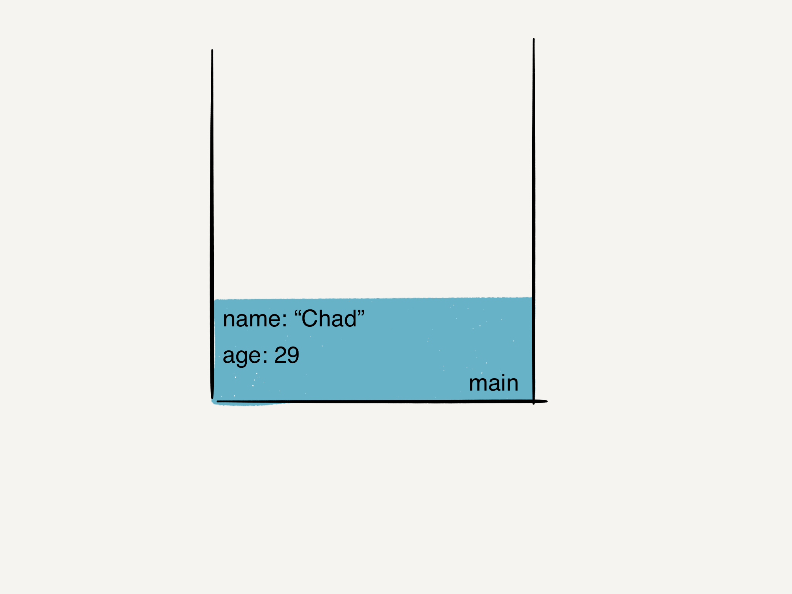
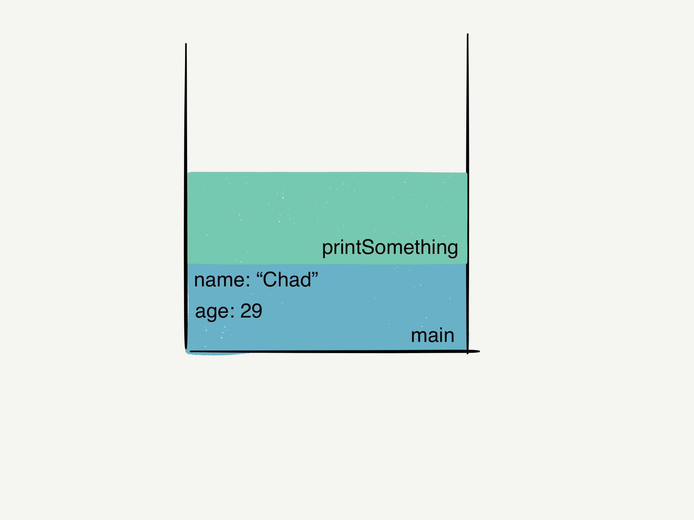
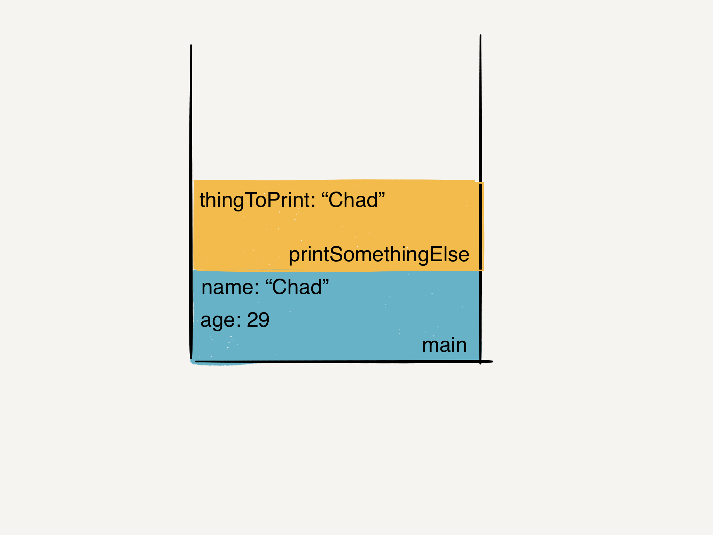
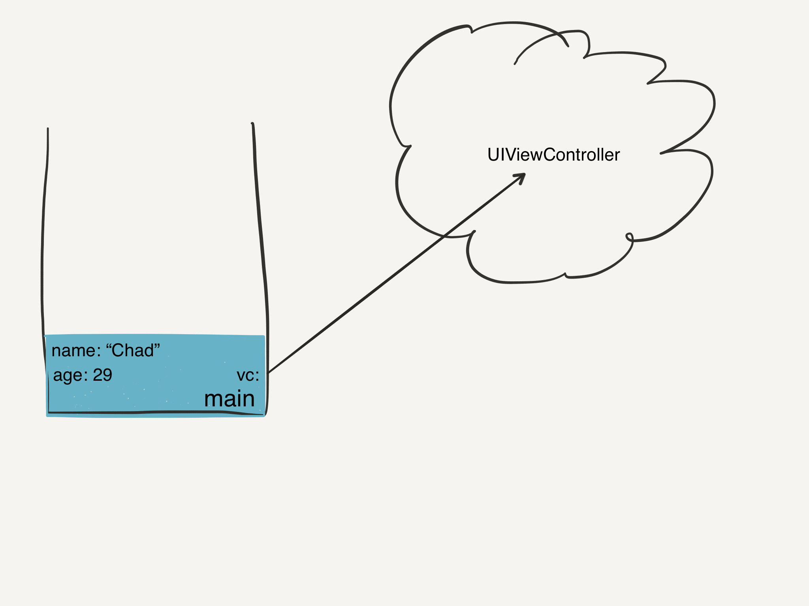
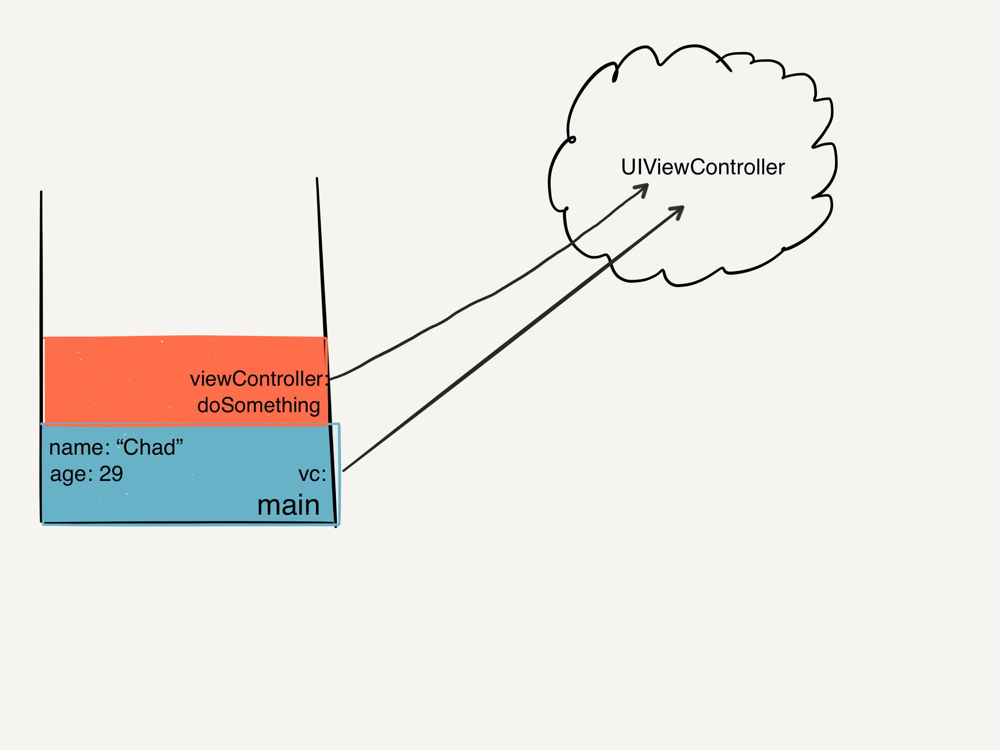
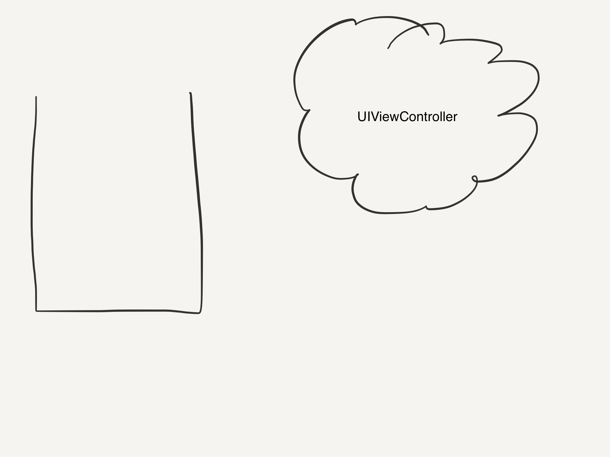

## Returning Multiple Values

```swift
func refreshWebPage() -> (Int, String) {
    return (200, "Success")
}
```

You can return multiple values in a tuple.

---

## Tuples

- Just a grouping of values. Any type. Any number.

`(3.79, 4.0, 3.99)` // (Double, Double, Double)
`(404, "URL not found")` // (Int, String)

---

## Tuples (cont)

```swift
func refreshWebPage() -> (Int, String) {
    return (200, "Success")
}

let (statusCode, message) = refreshWebPage()
print("Received \(statusCode): \(message)")

let response = refreshWebpage()
response.0 // an Int
response.1 // a String
```

---

## Tuples (cont)

```swift
func refreshWebPage() -> (code: Int, message: String) {
    return (200, "Success")
}

let response = refreshWebpage()
response.code // 200
response.message // "Success"
```

---

## Closures (Anonymous Functions)

```swift
let greetingPrinter = {
    print("Hello World")
}

let greetingPrinter : () -> () = {
    print("Hello World")
}

func greetingPrinter() -> () {
    print("Hello World")
}
```

In Swift, functions are just closures with names.

---

## Closures as parameters to a function!

```swift
func execute(times: Int, task: () -> ()) {
    for i in 1...times {
        task()
    }
}

execute(4, task: {
    print("Hello")
})
```

---

## Improvements

```swift
func execute(times: Int, task: () -> ()) {
    for _ in 1...times { //unused i
        task()
    }
}

execute(4) {
    print("Hello")
}
```

---

## Classes

```swift
class Vehicle {

}
```
No required base class. Swift doesn't have a universal base class.

```swift
class Bicycle: Vehicle { //Inheritance

}
```

---

## Classes With Properties

```swift
class Vehicle {
    var numberOfWheels = 0
    var description: String { //Computed property
        get {
            return "\(numberOfWheels) wheels"
        }
    }
}

class Vehicle {
    var numberOfWheels = 0
    var description: String {
        return "\(numberOfWheels) wheels"
    }
}
```

---

description is read-only since there is no setter

Why is description a var?

---

## Creating instance of a Class

```swift
class Vehicle {
    var numberOfWheels = 0 // This is a property
    var description: String { // Computed property
        return "\(numberOfWheels) wheels"
    }
}

let someVehicle = Vehicle()
// let someVehicle: Vehicle = Vehicle()
```

---

## Accessing properties of a class

```swift
let someVehicle = Vehicle()
print(someVehicle.description) // 0 wheels
someVehicle.numberOfWheels = 2
print(someVehicle.description) // 2 wheels
```

---

## Creating an initializer

```swift
class Bicycle: Vehicle {
    init() {
        super.init()
        numberOfWheels = 2
    }
}

let myBicycle = Bicycle()
```

---

## Overriding Properties

```swift
class Car: Vehicle {
    var speed = 0.0
    init() {
      super.init()
      numberOfWheels = 4
    }

    override var description: String {
        return super.description + ", \(speed) mph"
    }
}
```

---

## Property Observing

```swift
class ParentsCar: Car {
    override var speed: Double {
        willSet {
            if newValue > 65.0 {
                print("Careful!")
            }
        }
        didSet {
            //oldValue
        }
    }
}

let p = ParentsCar()
p.speed = 67
```

---

## Methods

```swift
class Counter {
    var count = 0
    func increment() {
        count += 1
    }

    func incrementBy(amount: Int) {
        count += amount
    }

    func resetCount(count: Int) {
        self.count = count
    }
}
```

---

## Structures

```swift
struct Point {
    var x, y: Double
}

struct Size {
    var width, height: Double
}

struct Rect {
    var origin: Point
    var size: Size
}
```

---

- Memberwise initializers come for free

```swift
var point = Point(x: 0.0, y: 0.0)
var size = Size(width: 640.0, height: 480.0)
var rect = Rect(origin: point, size: size)
```

- Computed properties & functions same as Classes

```swift
struct Rect{
    var origin: Point
    var size: Size

    var area: Double {
        return size.width * size.height
    }

    func isBiggerThan(other: Rect) -> Bool {
        return self.area > other.area
    }
}
```

---

# [fit] Structure vs Class?

---

### struct vs class

- structs cannot inherit from other structs
- structs pass-by-value, classes pass-by-reference
- (more on this in a bit)

---

# Creating a Stack Of Ints
## How I want the API to look
```swift
var myStack = IntStack()
myStack.push(1)
myStack.push(2)
myStack.pop() // 2
```
---
# Building a Stack of `Int`s
```swift
struct IntStack {
    private var elements = [Int]()

    mutating func push(element: Int) {
        elements.append(element)
    }

    mutating func pop() -> Int {
        return elements.removeLast()
    }
}
```
---
# Building a Stack of `T`'s
```swift
struct Stack<T> {
    private var elements = [T]()

    mutating func push(element: T) {
        elements.append(element)
    }

    mutating func pop() -> T {
        return elements.removeLast()
    }
}
```
---
## Use any type we want in our `Stack`
```swift
var myIntStack = Stack<Int>()
myIntStack.push(1)
myIntStack.push(2)
myIntStack.pop() // 2
```
```swift
struct Person {
    let name: String
    let age: Int
}

var myPersonStack = Stack<Person>()
myPersonStack.push(Person(name: "Chad", age: 29))
myPersonStack.push(Person(name: "Donald", age: 30))
myPersonStack.pop() // Person: Donald - 30
```
---
# Swift's Safety
```swift
var myIntStack = Stack<Int>()
myIntStack.push(1)
myIntStack.push(Person(name: "Chad", age: 29)) // Compiler error
```

---

# [fit] Enums

---

# [fit] Extensions

---

# Sort

```swift
let myCollection = [4, 7, 1, 5, 9, 8]

let sortedCollection = myCollection.sort()
// [1, 4, 5, 7, 8, 9]
```
---
## Sort Biggest to Smallest

```swift
func sort(@noescape isOrderedBefore: (Self.Generator.Element, Self.Generator.Element) -> Bool) -> [Self.Generator.Element]
```
- Give `sort` a closure as its 1 parameter
- Closure takes in 2 arguments
- Closure arguments are of same type as the collection's elements
- Closure returns a `Bool`

---

## Sort Biggest to Smallest (Cont.)
### Using our own closure that takes in two `Int`s and returns a `Bool`
```swift
let sortedCollection = myCollection.sort({ (a: Int, b: Int) -> Bool in
    return a > b
})

// [9, 8, 7, 5, 4, 1]
```
---
## Sort Biggest to Smallest (Cont.)
### Types are implied
```swift
let sortedCollection = myCollection.sort({ (a, b) -> Bool in
    return a > b
})

// [9, 8, 7, 5, 4, 1]
```
---
## Sort Biggest to Smallest (Cont.)
### Return type is implied
```swift
let sortedCollection = myCollection.sort({ (a, b) in
    return a > b
})

// [9, 8, 7, 5, 4, 1]
```
---
## Sort Biggest to Smallest (Cont.)
### Function is last parameter
```swift
let sortedCollection = myCollection.sort { (a, b) in
    return a > b
}

// [9, 8, 7, 5, 4, 1]
```
---
## Sort Biggest to Smallest (Cont.)
### Shorthand argument names
```swift
let sortedCollection = myCollection.sort {
    return $0 > $1
}

// [9, 8, 7, 5, 4, 1]
```
---
## Sort Biggest to Smallest (Cont.)
### One-line implicit return
```swift
let sortedCollection = myCollection.sort { $0 > $1 }

// [9, 8, 7, 5, 4, 1]
```
---
# How would *you* program `>` ?
---
# Writing `>`
```swift
infix operator > {}
func > <T: Equatable> (lhs: T, rhs: T) -> Bool {
  return ((lhs < rhs) || (lhs == rhs)) == false
}
```
---
# Looking Back at Sort
```swift
func sort(@noescape isOrderedBefore: (Self.Generator.Element, Self.Generator.Element) -> Bool) -> [Self.Generator.Element]
```
- Give it a closure
- Closure takes in 2 arguments
- Closure arguments are of same type as the collection's elements
- Closure returns a Bool

---
# What is `>` ?
- `>` is a function
- `>` takes in 2 arguments
- `>`'s arguments are the same type
- `>` returns a Bool

---
# Pass `sort` an existing function
```swift
myCollection.sort(>)

// [9, 8, 7, 5, 4, 1]
```
---
# Call Stack & Memory without ARC
```swift
func main() {
    let name = "Chad"
    let age = 29

    printSomething()
    printSomethingElse(name)

    let vc = UIViewController()
    doSomething(vc)

    print("Done")
}
```
---
```swift
func main() {
    let name = "Chad"
    let age = 29

    printSomething()
    printSomethingElse(name)

    let vc = UIViewController()
    doSomething(vc)

    print("Done")
}
```


---

```swift
func main() {
    let name = "Chad"
    let age = 29

    printSomething()
    printSomethingElse(name)

    let vc = UIViewController()
    doSomething(vc)

    print("Done")
}
```


---
```swift
func main() {
    let name = "Chad"
    let age = 29

    printSomething()
    printSomethingElse(name)

    let vc = UIViewController()
    doSomething(vc)

    print("Done")
}
```


---
```swift
func printSomethingElse(thingToPrint: String) {
    print("I guess i'll print \(thingToPrint)")
}
// I guess i'll print Chad
```
- The *value* "Chad" goes into the function

- `thingToPrint` has a value of "Chad"

- `String` is a "value type". It gets "passed by value".



---
```swift
func main() {
    let name = "Chad"
    let age = 29

    printSomething()
    printSomethingElse(name)

    let vc = UIViewController()
    doSomething(vc)

    print("Done")
}
```


---

```swift
func main() {
    let name = "Chad"
    let age = 29

    printSomething()
    printSomethingElse(name)

    let vc = UIViewController() // class
    doSomething(vc)

    print("Done")
}
```


---

```swift
func doSomething(viewController: UIViewController) {
    viewController.view.backgroundColor = .blackColor()
}
```

- The *reference* goes into the function
- reference = memory address
- `viewController` has a reference to the same memory as `vc`
- the UIViewController's view's background color is now black!



---

```swift
func main() {
    let name = "Chad"
    let age = 29

    printSomething()
    printSomethingElse(name)

    let vc = UIViewController()
    doSomething(vc)

    print("Done")
}
```


---

```swift
func main() {
    let name = "Chad"
    let age = 29

    printSomething()
    printSomethingElse(name)

    let vc = UIViewController()
    doSomething(vc)

    print("Done")
}
```


---

# Structs vs Classes

- Structs pass by value
- Classes pass by reference

# [Fit] That's it

---

# Left-over UIViewController in heap! ARC to the rescue!

- Helps clean up referenced objects when they're no longer needed
- Each instance of a class has a hidden `retainCount`
- Arrow begins pointing to the object: `retainCount += 1`
- Arrow stops pointing to an object: `retainCount -= 1`
- When retainCount hits 0, the object self-destructs

---

### What ARC does for you

```swift
func main() {
    let vc = UIViewController() // retainCount = 1
    doSomething(vc)
    // retainCount - 1 = 0
}
```

```swift
func doSomething(viewController: UIViewController) { // viewController retainCount = n
    // retainCount + 1 = n + 1
    viewController.view.backgroundColor = .blackColor()
    // retainCount - 1 = n
}
```

---

# Deinit in ARC (Self-Destruction!)

- When the UIViewController's retainCount reaches 0, it calls its own `deinit` function
- ARC memory performance is "deterministic"
- Compared to Garbage Collection which is "variable"
- Just another great feature you get from your Swift compiler!

---

# [fit] Protocols
